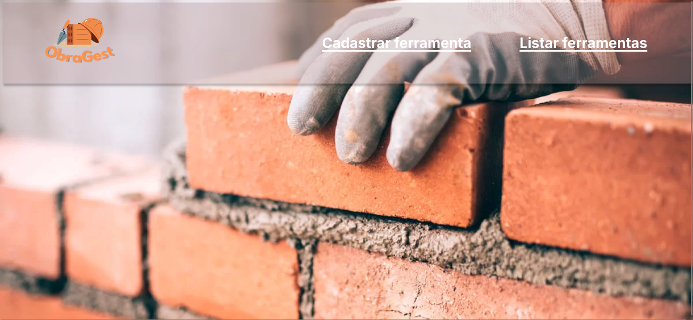
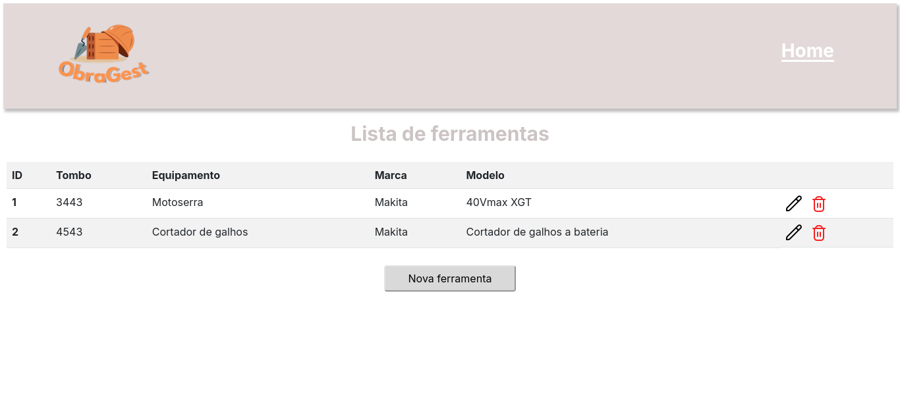
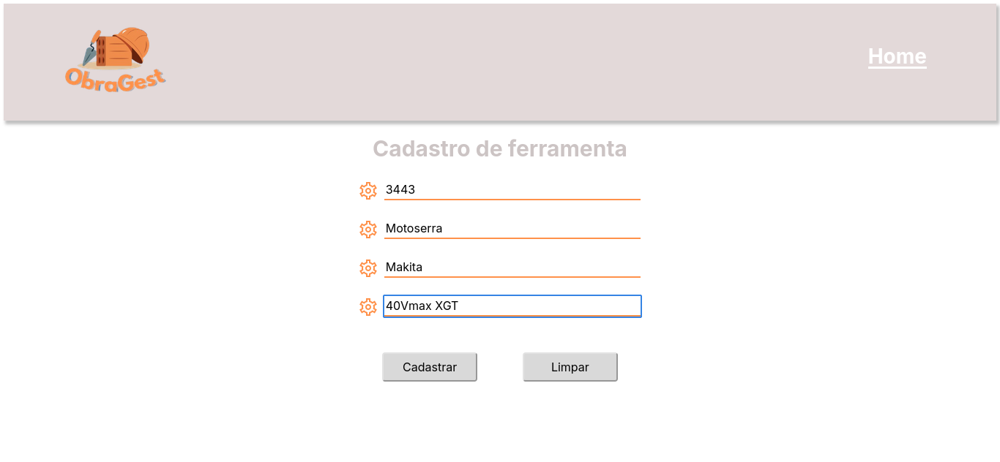
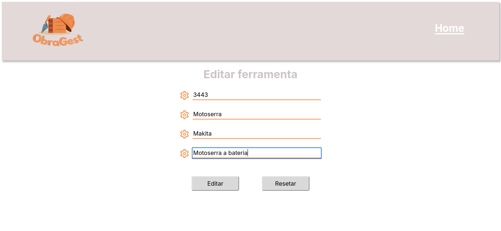
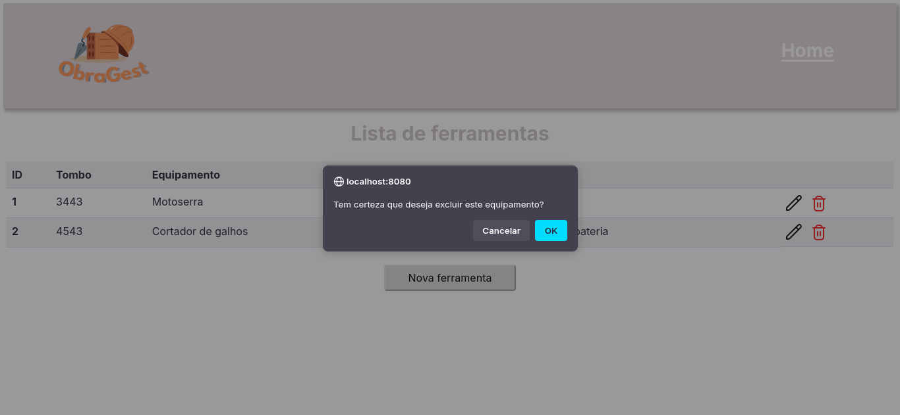

# 🔧 ObraGest

> 🚀 **Projeto final do curso Java Web Aranouá** – um sistema de gerenciamento para ferramentas.

<br>

## 📌 Sobre o Projeto

O **ObraGest** é um sistema desenvolvido em **Java JSP** para facilitar o gerenciamento de ferramentas.
## 🚀 Tecnologias Utilizadas

- **Java**
- **Java JSP**
- **CSS**

<br>

## 🎯 Funcionalidades

✅ Cadastro de ferramentas
✅ Listagem
✅ Edição
✅ Exclusão

<br>

## 🛠️ Aprendizados

Durante o desenvolvimento do **ObraGest**, aprofundei meus conhecimentos em requisições web e gerenciamento de Banco de dados, aplicando conceitos essenciais, como:

- **Data Acess Object(DAO)**
- **Arquitetura MVC**

<br>

## 📸 Imagens do Projeto

**Tela Home**


**Lista de ferramentas**


**Cadastro de uma nova ferramenta**


**Edição de ferramenta**


**Excluir Ferramenta**


<br>

## 📌 Como Executar o Projeto

1️⃣ Clone este repositório:

```sh
 git clone https://github.com/MatheusVictor23/ObraGest.git
```

2️⃣ Importe o projeto em sua IDE de preferência (**Eclipse**, **IntelliJ**, etc.)

3️⃣ Certifique-se de ter instalado:

- Apache Tomcat 11.0.5
- SDK 21

3️⃣ Execute o arquivo principal da aplicação.

---

🚀 *Desenvolvido por Matheus Victor*